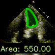
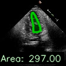
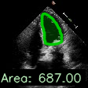
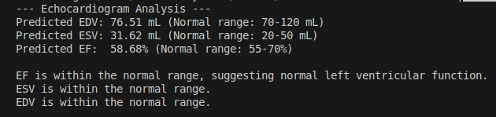

# ecocardiogram-ef-prediction
This project predicts the ejection fraction (EF) from echocardiogram videos using a deep learning pipeline.  
EF is a vital clinical metric for assessing cardiac function and detecting potential heart conditions.  

## Dataset
The models are trained and evaluated on the **EchoNet-Dynamic** dataset, which contains apical-4-chamber echocardiogram videos with ground truth EDV, ESV, and EF values.  
Data cleaning removed physiologically implausible and statistical outliers:  
- EDV: 50–300 mL  
- ESV: 15–100 mL  
- EF: 25–80%  
All samples satisfy ESV < EDV.  

## Methodology
The final EF prediction pipeline consists of four stages:  

### 1. Left Ventricle Keypoint Detection  
- A YOLOv11 pose estimation model is trained to predict 40 anatomical keypoints outlining the LV in each frame.  
- Keypoints are sorted around the centroid to form a closed contour and calculate the LV area per frame.  
#### sample output with the keypoints joined  
  
[Open GIF file](media/keypoints_visualization.gif)

### 2. Frame Selection (ESV & EDV)  
- LV area is tracked across the cardiac cycle.  
- The frame with the **minimum** LV area is selected as End-Systolic (ESV) frame.  
- The frame with the **maximum** LV area is selected as End-Diastolic (EDV) frame.  
- Each selected frame is stored along with its LV area and keypoints.  

ESV / EDV example frames:  
   
[esv_frame.png](media/esv_frame.png) · [edv_frame.png](media/edv_frame.png)

### 4. EF Calculation & Clinical Interpretation  
- EF is computed as: EF = (EDV − ESV) / EDV.  
- Predictions are compared to clinical thresholds:  
  - Normal EF: 55–70%  
  - Low EF (<55%): Systolic dysfunction (possible heart failure, ischemic cardiomyopathy)  
  - High EF (>70%): Hyperdynamic state (possible anemia, sepsis)  
- ESV and EDV ranges also evaluated for abnormal enlargement or volume overload.  

  
[final-analysis.png](media/final-analysis.png)


## Results
- ESV: RMSE = 23.97, MAE = 14.17, R² = 0.55  
- EDV: RMSE = 30.44, MAE = 21.32, R² = 0.56  
- EF: RMSE = 0.11, MAE = 0.09, R² = 0.21

## Installation & Setup

1. Create and activate a virtual environment:
```bash
python -m venv venv
source venv/bin/activate  # Linux/Mac
# or
.\venv\Scripts\activate  # Windows
```

2. Install requirements:
```bash
pip install -r requirements.txt
```

## Running the Pipeline

1. Update the video path in `full-pipeline/configs/yolo_keypoint.yaml`:
```yaml
video_path: "path/to/your/echo/video.mp4"
model_path: "models/yolo.pt"
image_size: 128
interpolation_points: 42
```

2. Run the analysis:
```bash
cd full-pipeline
python main.py
```
